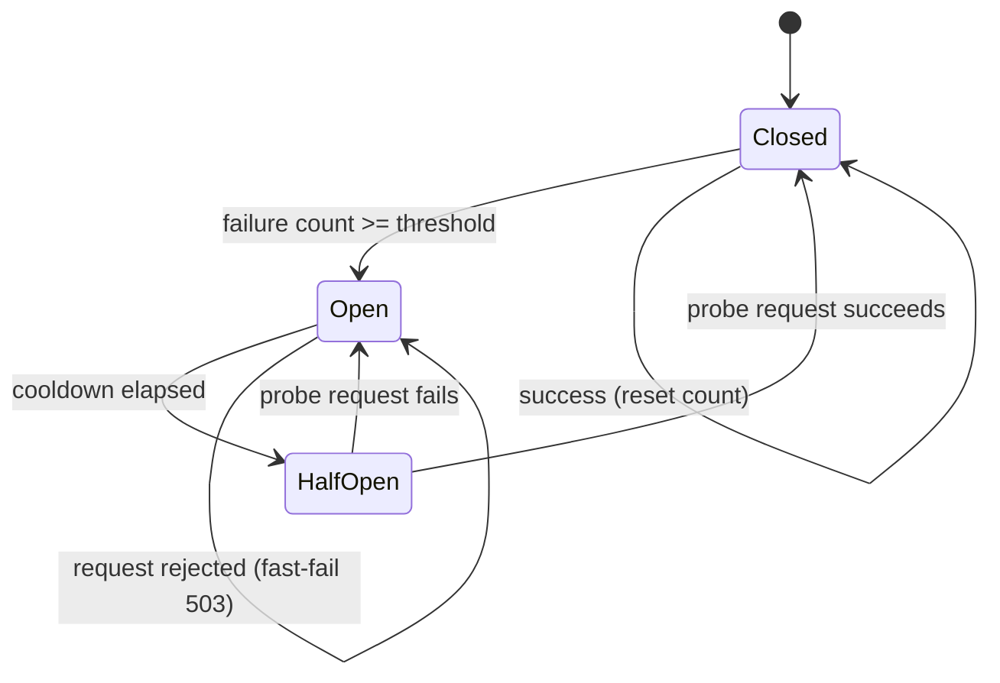

# Circuit Breaker State Machine

Per-provider Redis-backed circuit breaker with closed, open, and half-open states.

```mermaid
stateDiagram-v2
    [*] --> Closed

    Closed --> Open : failure count >= threshold
    Closed --> Closed : success (reset count)

    Open --> HalfOpen : cooldown elapsed
    Open --> Open : request rejected (fast-fail 503)

    HalfOpen --> Closed : probe request succeeds
    HalfOpen --> Open : probe request fails
```
