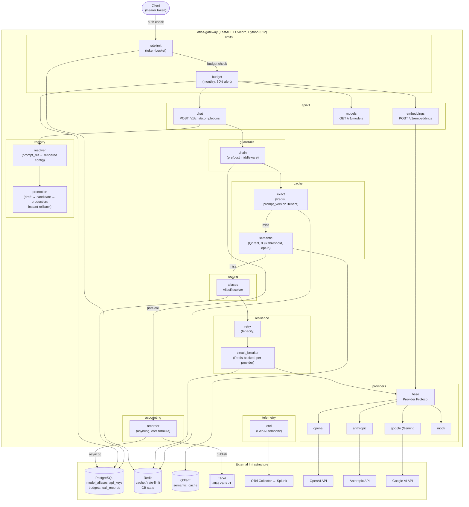

# Component Diagram — C4 Level 3: atlas-gateway

C4 Level 3 view of the internal `app/` modules and their relationships to external infrastructure dependencies.

```mermaid
flowchart TD
    Client(["Client\n(Bearer token)"])

    subgraph gateway["atlas-gateway (FastAPI + Uvicorn, Python 3.12)"]
        subgraph api["api/v1"]
            CHAT["chat\nPOST /v1/chat/completions"]
            MODELS["models\nGET /v1/models"]
            EMBED["embeddings\nPOST /v1/embeddings"]
        end

        subgraph limits["limits"]
            RL["ratelimit\n(token-bucket)"]
            BUD["budget\n(monthly, 80% alert)"]
        end

        subgraph guard["guardrails"]
            GC["chain\n(pre/post middleware)"]
        end

        subgraph cache["cache"]
            EC["exact\n(Redis, prompt_version+tenant)"]
            SC["semantic\n(Qdrant, 0.97 threshold, opt-in)"]
        end

        subgraph routing["routing"]
            AR["aliases\nAliasResolver"]
        end

        subgraph resilience["resilience"]
            RT["retry\n(tenacity)"]
            CB["circuit_breaker\n(Redis-backed, per-provider)"]
        end

        subgraph providers["providers"]
            BASE["base\nProvider Protocol"]
            OAI["openai"]
            ANT["anthropic"]
            GOO["google (Gemini)"]
            MOCK["mock"]
        end

        subgraph accounting["accounting"]
            REC["recorder\n(asyncpg, cost formula)"]
        end

        subgraph telemetry["telemetry"]
            OTEL["otel\n(GenAI semconv)"]
        end

        subgraph registry["registry"]
            RES["resolver\n(prompt_ref → rendered config)"]
            PROM["promotion\n(draft → candidate → production;\ninstant rollback)"]
        end
    end

    subgraph external["External Infrastructure"]
        PG[("PostgreSQL\nmodel_aliases, api_keys\nbudgets, call_records")]
        REDIS[("Redis\ncache / rate-limit\nCB state")]
        QDRANT[("Qdrant\nsemantic_cache")]
        KAFKA[["Kafka\natlas.calls.v1"]]
        OTELC["OTel Collector → Splunk"]
        PROV_OAI["OpenAI API"]
        PROV_ANT["Anthropic API"]
        PROV_GOO["Google AI API"]
    end

    Client -->|"auth check"| RL
    RL -->|"budget check"| BUD
    BUD --> CHAT
    BUD --> MODELS
    BUD --> EMBED

    CHAT --> GC
    GC --> EC
    EC -->|"miss"| SC
    SC -->|"miss"| AR
    AR --> RT
    RT --> CB
    CB --> BASE
    BASE --> OAI
    BASE --> ANT
    BASE --> GOO
    BASE --> MOCK

    CHAT --> RES
    RES --> PROM
    EMBED --> BASE

    GC -->|"post-call"| REC
    REC -->|"asyncpg"| PG
    REC -->|"publish"| KAFKA

    RL --> REDIS
    CB --> REDIS
    EC --> REDIS
    SC --> QDRANT
    BUD --> PG
    AR --> PG

    OTEL --> OTELC

    OAI --> PROV_OAI
    ANT --> PROV_ANT
    GOO --> PROV_GOO
```
