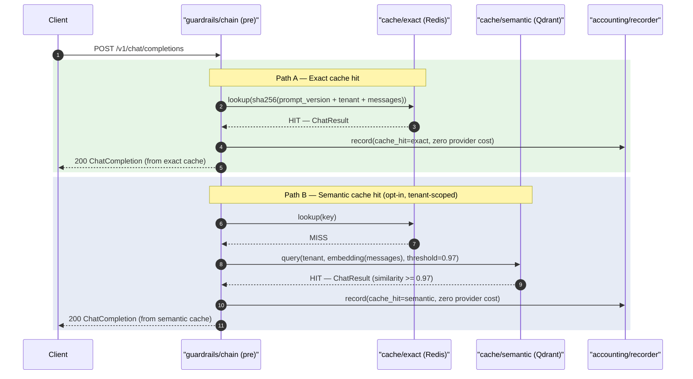

# Sequence Diagram — Cache Hit Paths

Exact-cache hit (Redis, fast path) and semantic-cache hit (Qdrant, opt-in, tenant-scoped) — both return without a provider call.

```mermaid
sequenceDiagram
    autonumber
    participant Client
    participant PreGuard as "guardrails/chain (pre)"
    participant ExactCache as "cache/exact (Redis)"
    participant SemanticCache as "cache/semantic (Qdrant)"
    participant Recorder as "accounting/recorder"

    Client->>PreGuard: POST /v1/chat/completions

    %% --- Exact cache hit path ---
    rect rgb(230, 245, 230)
        Note over PreGuard,ExactCache: Path A — Exact cache hit
        PreGuard->>ExactCache: lookup(sha256(prompt_version + tenant + messages))
        ExactCache-->>PreGuard: HIT — ChatResult
        PreGuard->>Recorder: record(cache_hit=exact, zero provider cost)
        PreGuard-->>Client: 200 ChatCompletion (from exact cache)
    end

    %% --- Semantic cache hit path ---
    rect rgb(230, 235, 245)
        Note over PreGuard,SemanticCache: Path B — Semantic cache hit (opt-in, tenant-scoped)
        PreGuard->>ExactCache: lookup(key)
        ExactCache-->>PreGuard: MISS
        PreGuard->>SemanticCache: query(tenant, embedding(messages), threshold=0.97)
        SemanticCache-->>PreGuard: HIT — ChatResult (similarity >= 0.97)
        PreGuard->>Recorder: record(cache_hit=semantic, zero provider cost)
        PreGuard-->>Client: 200 ChatCompletion (from semantic cache)
    end
```
