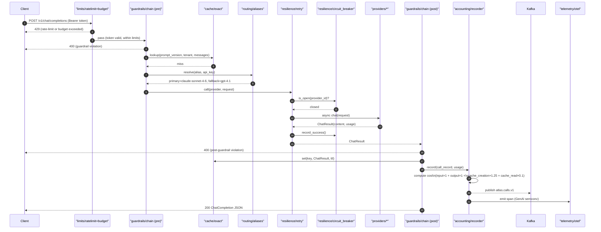

# Sequence Diagram — Non-Streaming Chat

Full request lifecycle for `POST /v1/chat/completions` (non-streaming) through all internal modules.

```mermaid
sequenceDiagram
    autonumber
    participant Client
    participant Auth as "limits/ratelimit+budget"
    participant PreGuard as "guardrails/chain (pre)"
    participant ExactCache as "cache/exact"
    participant Resolver as "routing/aliases"
    participant Retry as "resilience/retry"
    participant CB as "resilience/circuit_breaker"
    participant Provider as "providers/*"
    participant PostGuard as "guardrails/chain (post)"
    participant Recorder as "accounting/recorder"
    participant Kafka
    participant OTel as "telemetry/otel"

    Client->>Auth: POST /v1/chat/completions (Bearer token)
    Auth-->>Client: 429 (rate-limit or budget exceeded)
    Auth->>PreGuard: pass (token valid, within limits)
    PreGuard-->>Client: 400 (guardrail violation)
    PreGuard->>ExactCache: lookup(prompt_version, tenant, messages)
    ExactCache-->>PreGuard: miss
    PreGuard->>Resolver: resolve(alias, api_key)
    Resolver-->>PreGuard: primary=claude-sonnet-4-6, fallback=gpt-4.1
    PreGuard->>Retry: call(provider, request)
    Retry->>CB: is_open(provider_id)?
    CB-->>Retry: closed
    Retry->>Provider: async chat(request)
    Provider-->>Retry: ChatResult(content, usage)
    Retry->>CB: record_success()
    Retry-->>PostGuard: ChatResult
    PostGuard-->>Client: 400 (post-guardrail violation)
    PostGuard->>ExactCache: set(key, ChatResult, ttl)
    PostGuard->>Recorder: record(call_record, usage)
    Recorder->>Recorder: compute cost\n(input×1 + output×1 +\ncache_creation×1.25 + cache_read×0.1)
    Recorder-->>Kafka: publish atlas.calls.v1
    Recorder->>OTel: emit span (GenAI semconv)
    PostGuard-->>Client: 200 ChatCompletion JSON
```
