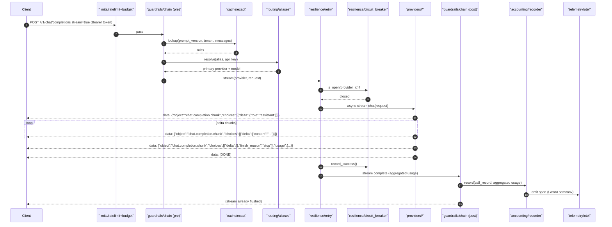

# Sequence Diagram — SSE Streaming Chat

SSE streaming path for `POST /v1/chat/completions` with `stream: true`, delivering `chat.completion.chunk` deltas and final `data: [DONE]`.

```mermaid
sequenceDiagram
    autonumber
    participant Client
    participant Auth as "limits/ratelimit+budget"
    participant PreGuard as "guardrails/chain (pre)"
    participant ExactCache as "cache/exact"
    participant Resolver as "routing/aliases"
    participant Retry as "resilience/retry"
    participant CB as "resilience/circuit_breaker"
    participant Provider as "providers/*"
    participant PostGuard as "guardrails/chain (post)"
    participant Recorder as "accounting/recorder"
    participant OTel as "telemetry/otel"

    Client->>Auth: POST /v1/chat/completions stream=true (Bearer token)
    Auth->>PreGuard: pass
    PreGuard->>ExactCache: lookup(prompt_version, tenant, messages)
    ExactCache-->>PreGuard: miss
    PreGuard->>Resolver: resolve(alias, api_key)
    Resolver-->>PreGuard: primary provider + model
    PreGuard->>Retry: stream(provider, request)
    Retry->>CB: is_open(provider_id)?
    CB-->>Retry: closed
    Retry->>Provider: async stream chat(request)

    Provider-->>Client: data: {"object":"chat.completion.chunk","choices":[{"delta":{"role":"assistant"}}]}
    loop delta chunks
        Provider-->>Client: data: {"object":"chat.completion.chunk","choices":[{"delta":{"content":"..."}}]}
    end
    Provider-->>Client: data: {"object":"chat.completion.chunk","choices":[{"delta":{},"finish_reason":"stop"}],"usage":{...}}
    Provider-->>Client: data: [DONE]

    Retry->>CB: record_success()
    Retry->>PostGuard: stream complete (aggregated usage)
    PostGuard->>Recorder: record(call_record, aggregated usage)
    Recorder->>OTel: emit span (GenAI semconv)
    PostGuard-->>Client: (stream already flushed)
```
