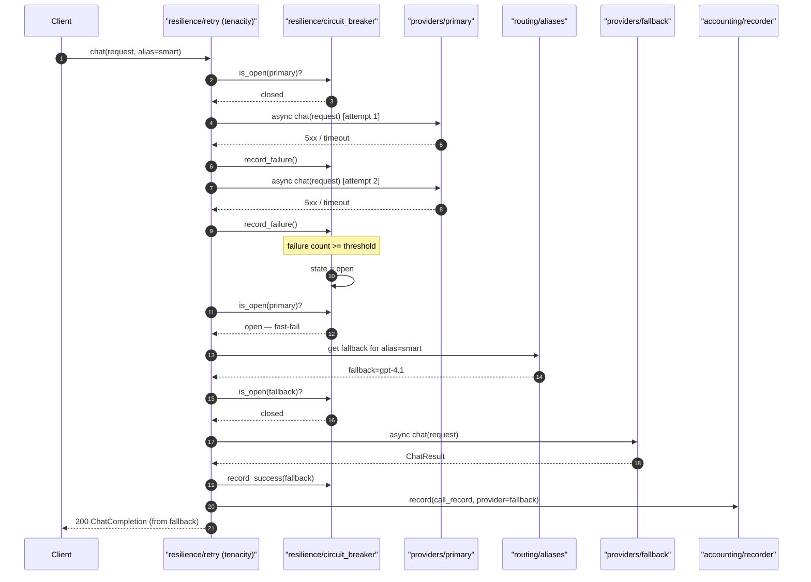

# Sequence Diagram — Provider Failover

Primary provider 5xx / timeout triggers tenacity retry, circuit breaker opens, then request fails over to the fallback model/provider.

```mermaid
sequenceDiagram
    autonumber
    participant Client
    participant Retry as "resilience/retry (tenacity)"
    participant CB as "resilience/circuit_breaker"
    participant Primary as "providers/primary"
    participant Resolver as "routing/aliases"
    participant Fallback as "providers/fallback"
    participant Recorder as "accounting/recorder"

    Client->>Retry: chat(request, alias=smart)

    Retry->>CB: is_open(primary)?
    CB-->>Retry: closed
    Retry->>Primary: async chat(request) [attempt 1]
    Primary-->>Retry: 5xx / timeout

    Retry->>CB: record_failure()
    Retry->>Primary: async chat(request) [attempt 2]
    Primary-->>Retry: 5xx / timeout

    Retry->>CB: record_failure()
    Note over CB: failure count >= threshold
    CB->>CB: state = open

    Retry->>CB: is_open(primary)?
    CB-->>Retry: open — fast-fail

    Retry->>Resolver: get fallback for alias=smart
    Resolver-->>Retry: fallback=gpt-4.1

    Retry->>CB: is_open(fallback)?
    CB-->>Retry: closed
    Retry->>Fallback: async chat(request)
    Fallback-->>Retry: ChatResult

    Retry->>CB: record_success(fallback)
    Retry->>Recorder: record(call_record, provider=fallback)
    Retry-->>Client: 200 ChatCompletion (from fallback)
```
